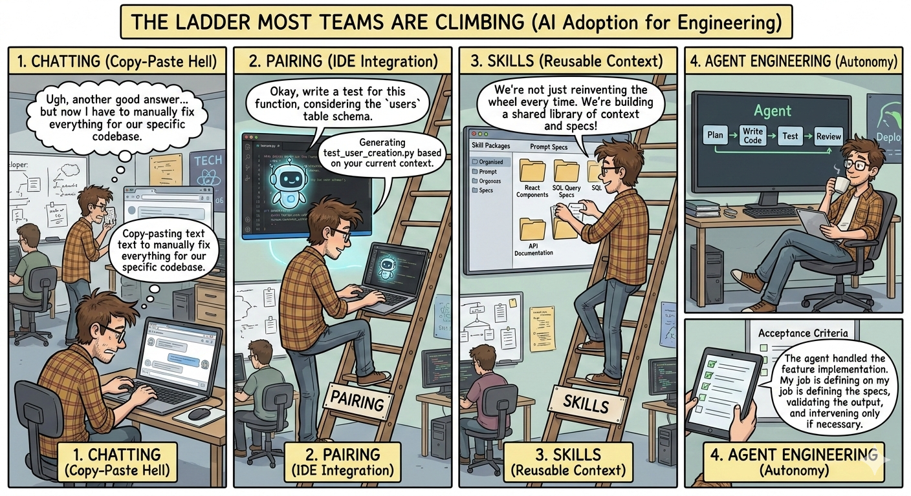

# From Prompt to Gold

> **A No-Code Data Engineering Challenge on Microsoft Fabric + dbt**



Can you build a production-ready data pipeline **without writing a single line of code**?

This repo is a starter kit for a hands-on challenge: starting from an **empty Fabric tenant**,
provision your infrastructure, load the open [Contoso V2](https://github.com/sql-bi/Contoso-Data-Generator-V2-data)
retail dataset into a Fabric Lakehouse, transform it through a medallion architecture using dbt,
and deliver a clean, tested Gold layer — all driven entirely by AI prompts.

---

## The Challenge

Read **[CHALLENGE.md](./CHALLENGE.md)** for the full brief, rules, phases, and acceptance criteria.

Stuck? Check **[HINTS.md](./HINTS.md)** for Fabric-specific gotchas and tips.

---

## Architecture

```
[Empty Fabric Tenant]
        │  fab-cli (AI-prompted)
        ▼
Workspace → Lakehouse (contoso_lakehouse) + Warehouse (contoso_warehouse)
        │
        │  Notebook (pandas-bridge ingestion)
        ▼
Bronze Delta tables  →  silver (dbt)  →  gold (dbt)  →  serving views (dbt)
                                                          europe_fct_sales
```

Full details: [architecture.md](./architecture.md)

---

## What's Provided

| File/Folder | What it is |
|---|---|
| `notebooks/01_ingest_contoso.ipynb` | Ingestion notebook — upload and run in Fabric |
| `dbt/` | dbt project with source definitions and model stubs |
| `.opencode/skills/` | AI agent skills for fab-cli and Fabric notebook patterns |
| `AGENTS.md` | Full context for your AI agent — share this first |
| `HINTS.md` | Fabric quirks and gotchas |
| `architecture.md` | Architecture reference |

No scripts. No pre-built workspace. You provision everything via AI prompts.

---

## Prerequisites

- Microsoft Fabric workspace (trial or capacity)
- Python 3.10+
- [fab-cli](https://github.com/microsoft/fabric-cli): `pip install ms-fabric-cli`
- [dbt-fabric](https://docs.getdbt.com/docs/core/connect-data-platform/fabric-setup): `pip install dbt-fabric`
- Azure CLI for dbt auth: `pip install azure-cli`

---

## Quickstart

```bash
# 1. Clone this repo
git clone https://github.com/SubmitCode/contoso-fabric-dbt.git
cd contoso-fabric-dbt

# 2. Share AGENTS.md with your AI agent — this is the most important step
#    "Read AGENTS.md before we begin."

# 3. Prompt your agent to provision Fabric resources using fab-cli
#    Workspace → Lakehouse (contoso_lakehouse) → Warehouse (contoso_warehouse)

# 4. Upload and run the ingestion notebook in Fabric
#    notebooks/01_ingest_contoso.ipynb

# 5. Configure dbt
cp dbt/profiles.yml.example ~/.dbt/profiles.yml
# Fill in your Warehouse SQL endpoint

# 6. Accept the challenge — no manual coding from here!
#    Read CHALLENGE.md, open your AI agent, and prompt your way to green.

cd dbt && dbt run && dbt test
```

---

## Dataset

[Contoso Data Generator V2](https://github.com/sql-bi/Contoso-Data-Generator-V2-data/releases/tag/ready-to-use-data)
— open sample retail dataset by SQLBI. This project uses the `parquet-100k` release (~100,000 orders).

---

## Stack

| Component | Technology |
|---|---|
| Lakehouse (Bronze) | Microsoft Fabric Lakehouse (Delta) |
| Warehouse (Silver/Gold/Serving) | Microsoft Fabric Warehouse |
| Transformations | dbt + dbt-fabric adapter |
| Workspace setup | fab-cli (ms-fabric-cli) |
| Ingestion | Fabric Notebook (pandas + PySpark) |

---

## Security — Keep Your Credentials Out of the Agent Context

This challenge involves authenticating to live cloud services. A few ground rules:

- **Authenticate as yourself**, not via service principals. Use `fab auth login` (browser) and
  `az login --use-device-code` (terminal). Your own identity is already scoped to what you need.
- **Never paste credentials, tokens, or secrets into your AI agent chat.** Once in the context
  window they can appear in logs, completions, or retries.
- **Never commit credentials.** The `.gitignore` already excludes `profiles.yml` and `.env`
  files, but double-check before pushing.
- **Do not add service principal client secrets** to `profiles.yml` or any tracked file, even
  temporarily. If you need unattended auth, use managed identity or short-lived tokens via
  environment variables — and clear them after use.

The `profiles.yml.example` intentionally contains only placeholders. Fill in real values only
in `~/.dbt/profiles.yml` (which is gitignored).

---

## License

MIT — use freely, share your results!
